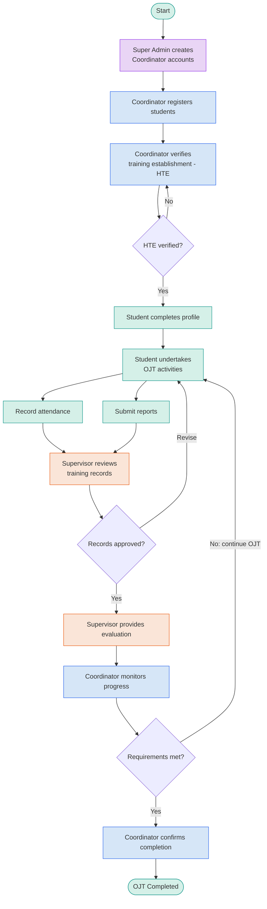

# OJT System Process Flow

Renders on GitHub and in any Mermaid viewer. Colors: purple = Super Admin, blue = Coordinator, green = Student, orange = HTE Supervisor.

```mermaid
flowchart TD
    start([Start]):::student --> sa[Super Admin creates<br/>Coordinator accounts]:::admin
    sa --> reg[Coordinator registers students]:::coord
    reg --> hte[Coordinator verifies<br/>training establishment - HTE]:::coord
    hte --> hteok{HTE verified?}
    hteok -- No --> hte
    hteok -- Yes --> profile[Student completes profile]:::student
    profile --> ojt[Student undertakes<br/>OJT activities]:::student
    ojt --> att[Record attendance]:::student
    ojt --> rep[Submit reports]:::student
    att --> review[Supervisor reviews<br/>training records]:::sup
    rep --> review
    review --> recok{Records approved?}
    recok -- Revise --> ojt
    recok -- Yes --> eval[Supervisor provides evaluation]:::sup
    eval --> mon[Coordinator monitors progress]:::coord
    mon --> done{Requirements met?}
    done -- No: continue OJT --> ojt
    done -- Yes --> confirm[Coordinator confirms completion]:::coord
    confirm --> fin([OJT Completed]):::student

    classDef admin fill:#e9d5f5,stroke:#9333ea
    classDef coord fill:#d6e6f7,stroke:#2563eb
    classDef student fill:#d5f0e8,stroke:#0d9488
    classDef sup fill:#fae5d8,stroke:#ea580c
```
